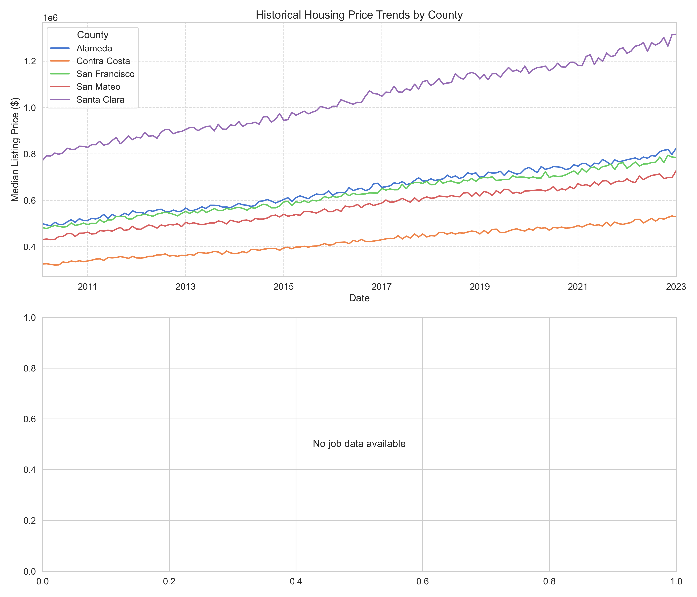

# housing-analysis



## Overview
this project does not fully work yet, several issues that still need to be fixed before that can happen

This project analyzes historical housing and job market data to predict future affordability and recommend optimal locations based on:
- Job field and experience level
- Housing prices and appreciation rates
- Commute times
- Affordability metrics

The system combines predictive modeling with geospatial analysis to provide personalized recommendations for where to live and work based on projected future conditions.

## Key Features

- **Historical trend analysis** of housing prices and job salaries
- **ARIMA models** for housing price forecasting
- **Random Forest regressors** for appreciation rate prediction
- **Affordability scoring** based on mortgage calculations
- **Personalized location recommendations** with multi-criteria scoring
- **Interactive visualizations** of trends and recommendations

## Requirements

- Python 3.7+
- Required packages:
  ```bash
  pip install pandas numpy matplotlib seaborn scikit-learn statsmodels tqdm kagglehub
